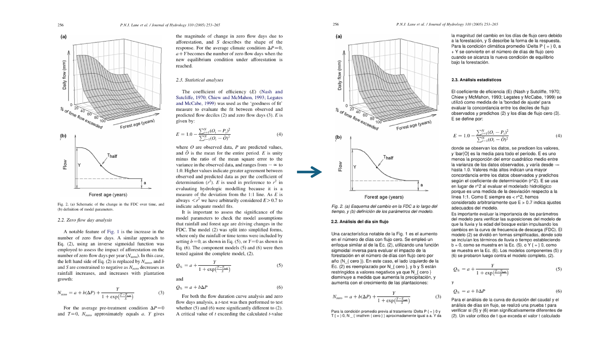

# Traductor de PDF

Un kit de herramientas de Python para traducir documentos PDF del **inglés al español** mientras se conserva el formato y la estructura originales.



## Características

- **Conservación del formato**: Mantiene la estructura original del documento (párrafos, títulos, leyendas, notas al pie)
- **Múltiples métodos de extracción**: Modo rápido para PDFs simples, modo preciso para documentos complejos
- **Múltiples motores de traducción**: API de OpenAI o modelos locales gratuitos de MarianMT
- **Conservación de fórmulas**: Las fórmulas y ecuaciones en LaTeX permanecen intactas
- **Caché inteligente**: Reduce los costos de la API almacenando en caché las traducciones

## Instalación

```bash
# Clone the repository
git clone https://github.com/Aleexc12/doc-translator.git
cd doc-translator

# Install dependencies
pip install -r requirements.txt

# Set up environment variables (for OpenAI)
cp .env.example .env
# Edit .env with your OpenAI API key
```

## Uso

Se recomienda colocar sus PDFs en la carpeta `pdfs/` para mantener el orden. Se incluyen 3 PDFs de demostración para pruebas.

```bash
python translate_cli.py demo1.pdf
```

La CLI buscará automáticamente en `pdfs/` si no se encuentra el archivo en el directorio raíz.

**Salida:** Los PDFs traducidos se guardan en `output_pdfs/`

### Otros casos de uso

#### PDFs de texto simple (Rápido)

Para documentos sencillos con formatos simples:

```bash
# OpenAI (best quality)
python translate_cli.py demo1.pdf --extractor pymupdf

# MarianMT (free, no API key)
python translate_cli.py demo1.pdf --extractor pymupdf --translator marianmt
```

#### Documentos complejos (Preciso)

Para artículos académicos, documentos técnicos con fórmulas, tablas o formatos complejos:

```bash
# OpenAI (best quality)
python translate_cli.py demo1.pdf

# MarianMT (free, no API key)
python translate_cli.py demo1.pdf --translator marianmt
```

### Opciones

| Opción | Descripción |
|--------|-------------|
| `--extractor pymupdf` | Extracción rápida para PDFs de texto simple |
| `--extractor mineru` | Extracción precisa para formatos complejos (predeterminado) |
| `--extractor docling` | Extracción precisa para formatos complejos |
| `--translator openai` | Traducción con OpenAI, mejor calidad (predeterminado) |
| `--translator marianmt` | Traducción local gratuita, no requiere clave API |
| `--translator ollama` | Traducción con LLM local, no requiere clave API |
| `--f` | Forzar reextracción (ignorar caché) |

## Requisitos

- Python 3.11+
- Clave API de OpenAI (opcional, para el traductor de OpenAI)
- Se recomienda GPU para MarianMT (también funciona en CPU, pero más lento)

## Por hacer

- [ ] Reemplazo real de texto (el método actual de superposición conserva el texto original en la estructura del PDF)
- [x] Soporte para LLMs locales (Ollama, llama.cpp)
- [ ] Soporte multilingüe (actualmente solo de inglés a español)
- [ ] Soporte para fórmulas en línea


## Licencia

Licencia MIT

## Agradecimientos

- [MinerU](https://github.com/opendatalab/MinerU) por la extracción de la estructura de documentos
- [Docling](https://docling-project.github.io/docling/) por la extracción de la estructura de documentos
- [Ollama](https://ollama.com/) por la traducción con LLM local
- [Helsinki-NLP](https://huggingface.co/Helsinki-NLP) por los modelos MarianMT
