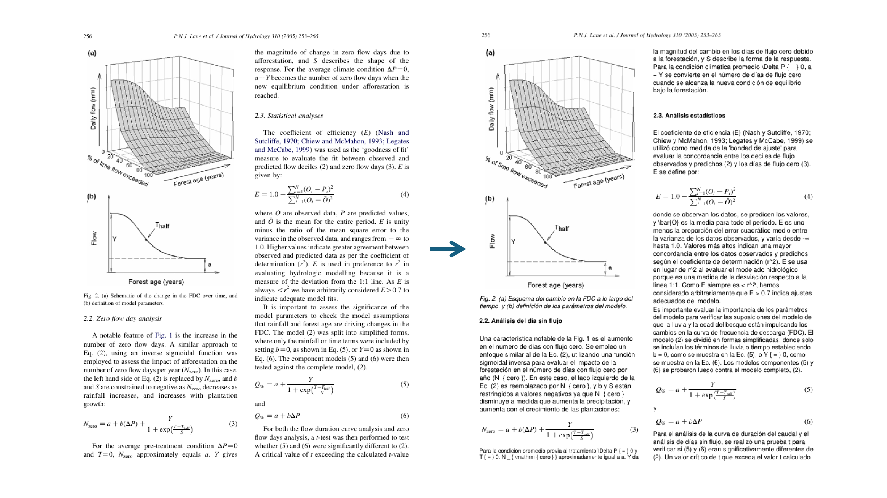

# PDF Translator

A Python toolkit for translating PDF documents from **English to Spanish** while preserving the original layout and structure.



## Features

- **Layout Preservation**: Maintains original document structure (paragraphs, titles, captions, footnotes)
- **Multiple Extraction Methods**: Fast mode for simple PDFs, accurate mode for complex documents
- **Multiple Translation Backends**: OpenAI API or free local MarianMT models
- **Formula Preservation**: LaTeX formulas and equations remain intact
- **Smart Caching**: Reduces API costs by caching translations

## Installation

```bash
# Clone the repository
git clone https://github.com/yourusername/pdf-translator.git
cd pdf-translator

# Install dependencies
pip install -r requirements.txt

# Set up environment variables (for OpenAI)
cp .env.example .env
# Edit .env with your OpenAI API key
```

## Usage

Place your PDF files in the `pdfs/` folder, then run:

### Simple Text PDFs (Fast)

For straightforward documents with simple layouts:

```bash
# Using OpenAI (best quality)
python translate_cli.py pdfs/document.pdf --extractor pymupdf

# Using MarianMT (free, no API key needed)
python translate_cli.py pdfs/document.pdf --extractor pymupdf --translator marianmt
```

### Complex Documents (Accurate)

For academic papers, technical documents with formulas, tables, or complex layouts:

```bash
# Using OpenAI (best quality)
python translate_cli.py pdfs/document.pdf

# Using MarianMT (free, no API key needed)
python translate_cli.py pdfs/document.pdf --translator marianmt
```

### Options

```bash
python translate_cli.py document.pdf [options]

--extractor pymupdf    # Fast extraction (simple PDFs)
--extractor mineru     # Accurate extraction (complex PDFs, default)
--translator openai    # OpenAI translation (default, requires API key)
--translator marianmt  # Free local translation (no API key)
-o output.pdf          # Custom output path
--f                    # Force re-extraction (ignore cache)
```

## Requirements

- Python 3.8+
- PyMuPDF
- OpenAI API key (optional, for OpenAI translator)
- GPU recommended for MarianMT (works on CPU too, just slower)

## TODO

- [ ] True text replacement (current overlay method preserves original text in PDF structure)
- [ ] Support for local LLMs (Ollama, llama.cpp)
- [ ] Additional translation providers (DeepL, Google Translate)
- [ ] Multi-language support (currently English to Spanish only)
- [ ] Web interface
- [ ] Batch processing for multiple PDFs

## License

MIT License

## Acknowledgments

- [PyMuPDF](https://pymupdf.readthedocs.io/) for PDF manipulation
- [MinerU](https://github.com/opendatalab/MinerU) for document structure extraction
- [Helsinki-NLP](https://huggingface.co/Helsinki-NLP) for MarianMT models
- [OpenAI](https://openai.com/) for GPT translation API
